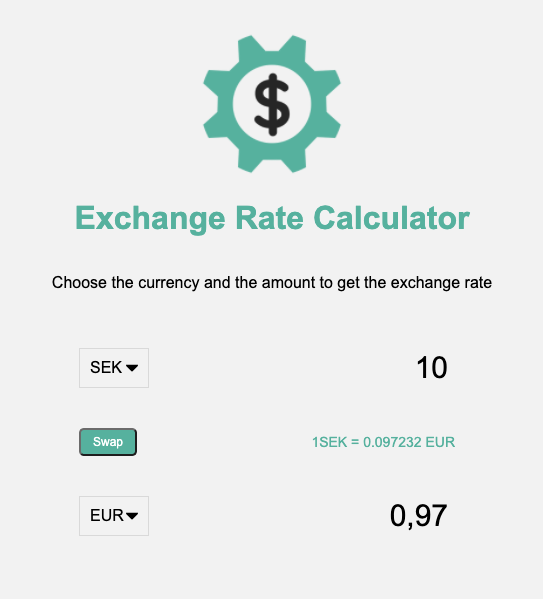

# Exchange rate calculator

An Exchange rate calculator using the ExchangeRate-API to get correct exchange rates. Built purely with HTML, CSS and JavaScript.

ExchangeRate-API, (https://exchangerate-api.com)

# Screenshots

Exchange rate calculator

## Author

- Albert Stjärne (https://github.com/AlbertStjarne)
